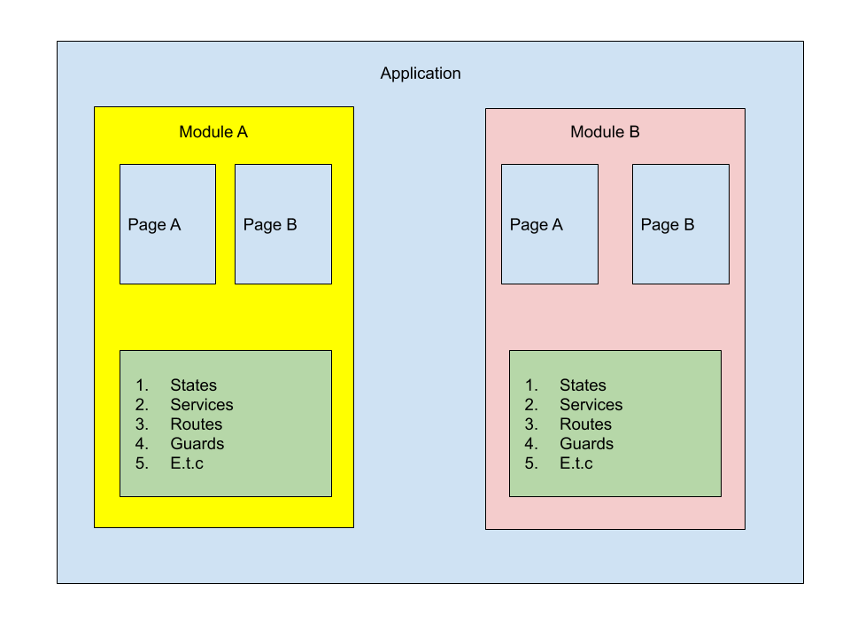

# BFastUI - Introduction

State and UI architecture library for flutter inspired
by [flutter_modular](https://modular.flutterando.com.br/docs/flutter_modular/start)
for architecture and ChangeNotifier pattern for states.



## Installation

Open your project's `pubspec.yaml` and add `bfastui` as a dependency:

```yaml
dependencies:
  bfastui: any
```

You can also provide the git repository as source instead, to try out the newest features and fixes:

```yaml
dependencies:
  bfastui:
    git:
      url: https://github.com/fahamutech/bfast-ui-flutter.git
```

## Module

You organised your domain in your application in modules. Module is a top level abstraction of your
application.

### MainModule

This is the bootstrap module for your application. Is only defined once in your application. You
will required to implement `initRoutes` and `initStates` method

* initRoutes - You will add all routes of the pages your module will use

* initStates - You will add all states you will use in your module

```dart

class MyApp extends MainModuleAdapter {
  @override
  List<RouterAdapter> initRoutes(String moduleName) => [];

  @override
  List<StateAdapter> initStates(String moduleName) => [];

}

```

### ChildModule

This is the feature module to enclose your specific business logic. Your will required to implement
the following methods.

* initRoutes - You will add all routes of the pages your module will use

* initStates - You will add all states you will use in your module

* moduleName - This will return your module name, name can be any `String` of your choice

```dart

class ProfileModule extends ChildModuleAdapter {
  @override
  List<RouterAdapter> initRoutes(String moduleName) => [];

  @override
  List<StateAdapter> initStates(String moduleName) => [];

  @override
  String moduleName() => 'profile-module';

}
```

## Page

Page is what your see presented by your mobile phone. i.e login page. Page belongs to a specific
module and characterised with `url` to navigate to. Page can have one or more components which make
the whole page functional. To create a page you extend `PageAdapter` and you will required to
implement `build` method which return a `Widget` represent that page.

* build(var args) - your must provide implementation for this method. `args` has the following properties

    ```dart
    final Map<String, dynamic> params;
    final Map<String, dynamic> queryParams;
    final dynamic data;
    ```

```dart

class MyPage extends PageAdapter {
  @override
  Widget build(var args) {
    // TODO: implement build
    throw UnimplementedError();
  }

}
```

## State

State call information of the current view of your page ( s ). State is a `ChangeNotifier` class to
be used with provider state management under the hood.

```dart
class MyState extends StateAdapter {
}
```

to notify listerner for changes your will just call `notifyListeners()`
as you would in `ChangeNotifier` class. You can use a state with `active widget` either consumer or selector. 
We provider factor method to produce either consumer widget or selector component.

```dart
class MyHomePage extends PageAdapter {
  @override
  Widget build(args) {
    return Scaffold(
      body: Container(
        color: Colors.red,
        child: Column(
          children: [
            consumerComponent<MyState>(
              builder: (context, state) => Text('${state.count}'),
            ),
            selectorComponent<MyState, int>(
              selector: (state) => state.count,
              builder: (c, data) => Text('$data'),
            )
          ],
        ),
      ),
    );
  }
}
```

## Route

A Route carry information of where to navigate to in your application and whether to allow someone
access or not. You can navigate to another Page or Module.

### Route Guard

To create a route guard

```dart

class MyRouteAuthGuard extends RouterGuardAdapter {
  @override
  Future<bool> canActivate(String url) {
    // TODO: implement canActivate
    throw UnimplementedError();
  }
}
```

when `canActivate` resolve to `true` the page or a module someone navigate to will be activated
otherwise will return to previous route if available

## Complete Application Example

```dart
import 'package:bfastui/adapters/main_module.dart';
import 'package:bfastui/adapters/page.dart';
import 'package:bfastui/adapters/router.dart';
import 'package:bfastui/adapters/state.dart';
import 'package:bfastui/controllers/component.dart';
import 'package:bfastui/controllers/module.dart';
import 'package:flutter/material.dart';

class MyHomePage extends PageAdapter {
  @override
  Widget build(args) {
    return Scaffold(
      body: Container(
        color: Colors.red,
        child: Column(
          children: [
            consumerComponent<MyState>(
              builder: (c, state) => Text('${state?.count}'),
            ),
            selectorComponent<MyState, int>(
              selector: (s) => s?.count ?? 0,
              builder: (c, data) => Text('$data'),
            )
          ],
        ),
      ),
    );
  }
}

class MyState extends StateAdapter {
  int count = 0;

  increase() {
    count += 1;
    notifyListeners();
  }

  decrement() {
    count -= 1;
    notifyListeners();
  }

  @override
  void onDispose() {}
}

class MyAppModule extends MainModuleAdapter {
  @override
  List<RouterAdapter> initRoutes(String moduleName) => [
    RouterAdapter('/home', page: (c, _) => MyHomePage()),
  ];

  @override
  List<StateAdapter> initStates(String moduleName) => [
    MyState(),
  ];
}

void main() {
  runApp(
    bfastUiApp(
      module: MyAppModule(),
      component: MaterialApp(
        initialRoute: '/home',
      ),
    ),
  );
}


```

